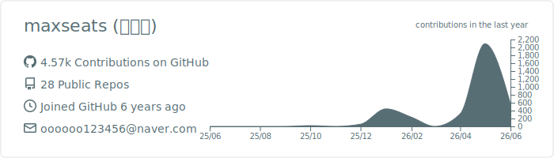
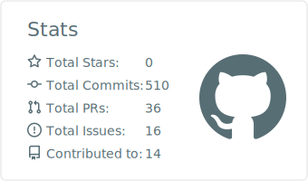
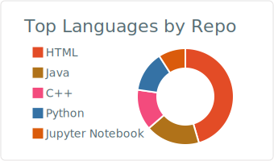
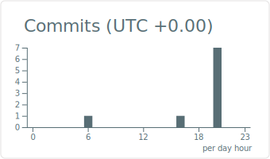
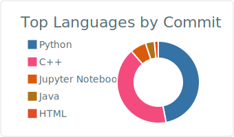

<!-- HEADER BANNER -->

  

<!-- TYPING IDENTITY LINE -->

  

---

### 👋 About me

문제를 정확히 정의하고, AI로 직접 만들어 푸는 빌더예요.
**LLM 애플리케이션**, **RAG**, **AI Agent**, **음성 인터페이스**처럼
실용적인 시스템을 끈질기게 깎아내는 걸 즐깁니다.

---

### 🧠 LLM / AI

  
  
  
  
  
  

### 🛠️ Backend & Infra

  

---

### 📊 GitHub Stats

  

  
  

  
  

---

### 📬 Contact

  
  
  

<a href="#readme-top">⬆ back to top</a>

